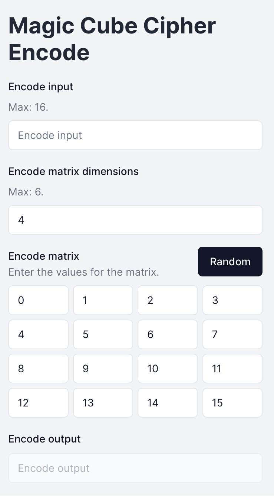

# Crypto tasks

# Задание 1. Шифр многоалфавитной замены Вижинера

https://crypto-tasks.vercel.app/task1

</img>

# Задание 2. Шифр Магический квадрат

https://crypto-tasks.vercel.app/task2

</img>

## Usage

```bash
npm run dev
```

## License

Licensed under the [MIT license](https://github.com/shadcn/ui/blob/main/LICENSE.md).
